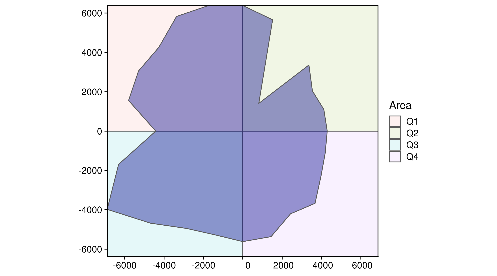

<!-- README.md is generated from README.Rmd. Please edit that file -->

# sitsfeats - Satellite Image Time Series Features 

R package for extracting metrics from time series of satellite images

<!-- badges: start -->

[](https://github.com/oldlipe/sitsfeats/actions)
[](https://codecov.io/gh/OldLipe/sitsfeats?branch=master)
[](https://lifecycle.r-lib.org/articles/stages.html#stable)
<!-- badges: end -->

The goal of the sitsfeats package is to extract temporal metrics from
satellite images time series. The metrics implemented in this version
are:

  - **basics**: statistics metrics
  - **polar**: polar metrics

The implementations of this package are based on the
[stmetrics](https://github.com/brazil-data-cube/stmetrics) library in
Python.

## Installation

You can install the development version of sitsfeats from
[github](https://github.com/OldLipe/sitsfeats) with:

``` r
library(devtools)
devtools::install_github("oldlipe/sitsfeats")
```

## How to use?

### Polar metrics example

``` r
# loading sitsfeats and tibble packages
library(sitsfeats)
library(tibble)

# loading example time series
data("timeseries")

polar_metrics <- tibble::tibble(area_q1 = sitsfeats::area_q1(timeseries),
                                area_q2 = sitsfeats::area_q2(timeseries),
                                area_q3 = sitsfeats::area_q3(timeseries),
                                area_q4 = sitsfeats::area_q3(timeseries))

polar_metrics
#> # A tibble: 5 x 4
#>   area_q1[,1] area_q2[,1] area_q3[,1] area_q4[,1]
#>         <dbl>       <dbl>       <dbl>       <dbl>
#> 1   29443841.   14207184.   30180681.   30180681.
#> 2   28600327.   11275172.   32912031.   32912031.
#> 3   39626598.   26313817.   39566583.   39566583.
#> 4   37874557.   16023772.   34952318.   34952318.
#> 5   23932473.   15016832.   27336259.   27336259.
```

### Polar metrics visualization

``` r
# get one instance from timeseries
one_instance <- timeseries[1,]

# plot first time series example
sitsfeats::polar_plot(one_instance)
```



## Getting help

Feel free to create issues if you have any questions.
